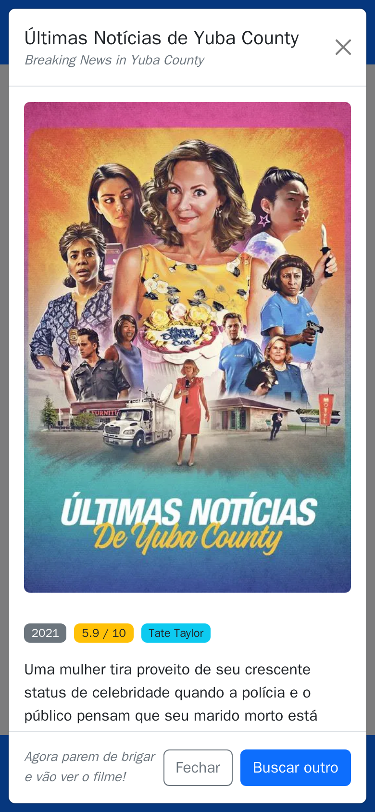
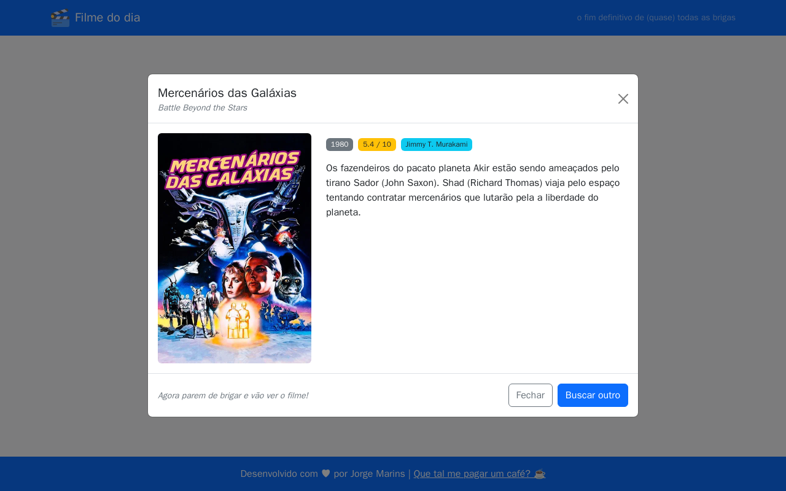

# 🎬 Filme do Dia

> O fim definitivo de todas as brigas sobre o que assistir hoje.

**Filme do Dia** é uma aplicação web estática que sorteia um filme aleatório com base nos seus filtros preferidos — ideal para aqueles momentos em que ninguém consegue decidir o que ver.

---

## 📸 Screenshots

<table>
  <thead>
    <tr>
      <th align="center">📱 Mobile</th>
      <th align="center">📟 Tablet</th>
      <th align="center">🖥️ Desktop</th>
    </tr>
  </thead>
  <tbody>
    <tr>
      <td align="center"></td>
      <td align="center"></td>
      <td align="center"></td>
    </tr>
    <tr>
      <td align="center"></td>
      <td align="center"></td>
      <td align="center"></td>
    </tr>
  </tbody>
</table>

---

## ✨ Funcionalidades

- Sorteio aleatório de filmes via [TMDB API](https://www.themoviedb.org/)
- Filtros configuráveis antes de cada busca:
  - **Sem terror** — exclui o gênero Terror
  - **Sem comédia romântica** — exclui o gênero Romance
  - **Sem animação** — exclui o gênero Animação
  - **Sem conteúdo adulto** *(ativado por padrão)*
  - **Só nota 7+** — nota mínima de 7/10, considerando apenas filmes com 100 votos ou mais
  - **Só dos últimos 10 anos**
  - **Modo hardcore** — libera títulos fora do alfabeto romano; sem ele, o sorteio fica restrito a idiomas de escrita latina
- Exibe pôster, título, ano de lançamento, nota e sinopse
- Layout responsivo e mobile-first com Bootstrap 5
- Deploy automático via GitHub Pages

---

## 🛠️ Tecnologias

| Tecnologia | Uso |
|---|---|
| HTML5 + JavaScript (vanilla) | Estrutura e lógica da aplicação |
| [Bootstrap 5.3](https://getbootstrap.com/) | Estilização e componentes responsivos |
| [TMDB API](https://developer.themoviedb.org/) | Fonte dos dados de filmes |
| GitHub Actions | CI/CD e injeção de variáveis de ambiente |
| GitHub Pages | Hospedagem estática |

> Este projeto não tem fins comerciais. Eu só quero evitar a fadiga.

---

## 🔗 Projeto irmão

Procurando uma série em vez de filme? Veja o [Série do Dia](https://jorgemarinsx.github.io/SerieDoDia/) ([repositório](https://github.com/jorgemarinsx/SerieDoDia)).

Desenvolvido com ♥ por [Jorge Marins](https://buymeacoffee.com/jorgemarins)

[Que tal me pagar um café? ☕ ](https://buymeacoffee.com/jorgemarins)
